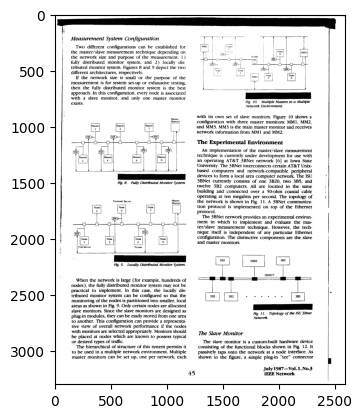
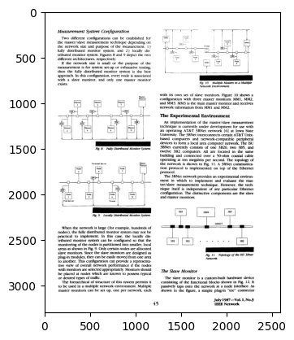
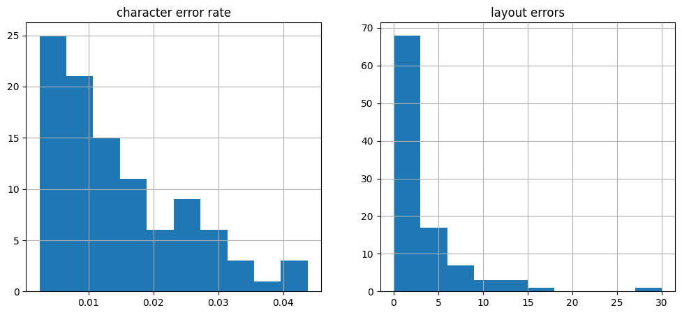
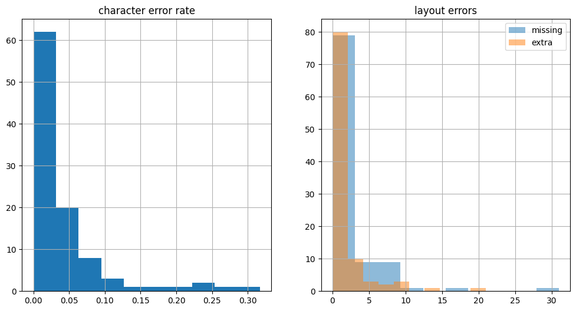
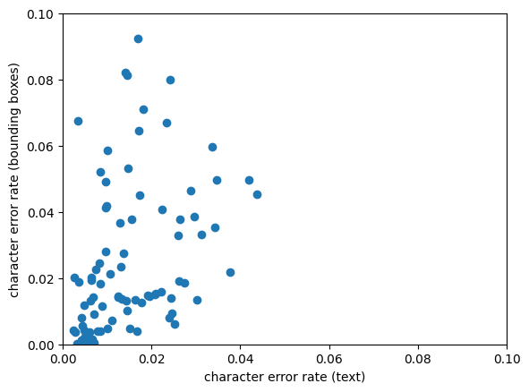

```python
%matplotlib inline
import matplotlib.pyplot as plt
import numpy as np
import pandas as pd
import webdataset as wds
import wids
```

# OCR Evaluation

This is a small repository containing code for measuring error rates of OCR systems.

OCR output and ground truth are assumed to be in hOCR format, Markdown, or plain text format.

Collections of pages and text files are assumed to be in WebDataset format (meaning, .tar archives with related files grouped together by name.)

Two evaluations are possible:

- text based evaluation performs a rough estimate of a block move edit distance
- bounding box based evaluation puts OCR and ground truth into correspondence using geometric information

Both evaluation methods use heuristics to arrive at error estimates. Nevertheless, they should be good enough to assess the relative performance of different OCR engines.

# Evaluation Dataset

We start with a small evaluation dataset of 100 pages stored in a tar archive (with WebDataset conventions).


```python
!tar tvf testdata/ocr-eval-hocr.tar | head
```

    -r--r--r-- bigdata/bigdata 17282 2023-12-22 10:39 E00P.hocr.html
    -r--r--r-- bigdata/bigdata 3779135 2023-12-22 10:39 E00P.page.jpg
    -r--r--r-- bigdata/bigdata   16740 2023-12-22 10:39 W188.hocr.html
    -r--r--r-- bigdata/bigdata 3763997 2023-12-22 10:39 W188.page.jpg
    -r--r--r-- bigdata/bigdata   18454 2023-12-22 10:39 W030.hocr.html
    -r--r--r-- bigdata/bigdata 4049422 2023-12-22 10:39 W030.page.jpg
    -r--r--r-- bigdata/bigdata    7642 2023-12-22 10:39 N026.hocr.html
    -r--r--r-- bigdata/bigdata 1617937 2023-12-22 10:39 N026.page.jpg
    -r--r--r-- bigdata/bigdata   15867 2023-12-22 10:39 C00J.hocr.html
    -r--r--r-- bigdata/bigdata 3541891 2023-12-22 10:39 C00J.page.jpg
    tar: stdout: write error


Looking at the images, we notice that there are page frames and (on some page) even text from opposing sides. This hinders OCR error evaluation.


```python
raw = wids.ShardListDataset([dict(url="testdata/ocr-eval-hocr.tar", nsamples=100)])
plt.imshow(raw[66][".page.jpg"], cmap="gray")
```

    [{'url': 'testdata/ocr-eval-hocr.tar', 'nsamples': base: None name: None nfiles: 1 nbytes: 0 samples: 100 cache: /tmp/_wids_cache


    <matplotlib.image.AxesImage at 0x7f0c28865150>


    

    


To remove the page frame, we run the `runocr reframe` command. This command infers a text bounding box from the hOCR ground truth and masks out any content outside that bounding box.


```python
!runocr reframe testdata/ocr-eval-hocr.tar --output ocr-eval-hocr-reframed.tar --hocr hocr.html --img page.jpg
```

    E00P 326 506 2422 3240
    W188 408 281 2171 3140
    W030 178 123 2334 3145
    N026 640 519 2528 3191
    C00J 255 217 2401 3204
    C001 248 80 2353 3027
    W1K0 396 562 2216 3115
    W143 346 146 2492 3157
    A00G 779 242 2314 2537
    H013 320 503 2229 3128
    S02G 123 37 2364 3248
    E04P 114 104 2263 3120
    W093 268 309 2313 3070
    J004 751 676 2069 2870
    W0I7 238 205 2159 3116
    W13B 149 99 2315 3115
    D05N 543 833 1901 3128
    K003 275 248 2423 3248
    W1J6 378 192 2312 3092
    W087 298 189 2049 3042
    N02F 425 380 2229 2839
    S00G 125 130 2024 2766
    W0I4 300 1126 2216 3089
    N03C 141 160 2288 3086
    W1I1 375 263 2303 3176
    E03G 817 710 2472 3179
    S035 193 66 1861 2890
    W1P5 229 995 2335 3134
    A04A 406 799 1852 2472
    W0A9 221 2065 2280 3153
    J00I 523 576 2058 3165
    E044 146 208 1808 2852
    W1S7 458 347 2268 3178
    D036 455 194 2028 2602
    H00I 553 458 2056 2835
    W1IJ 355 269 2292 3181
    J030 362 176 2364 3052
    D054 410 200 2112 2863
    D06K 194 191 2351 3213
    W1C4 348 903 1973 3133
    H00R 575 660 2084 3124
    H000 728 755 2079 3120
    C048 201 114 2443 3211
    N059 591 481 2380 2898
    W016 202 151 2203 3123
    W0T1 251 236 2053 3070
    W102 224 423 2287 3145
    W1S5 458 371 2267 3201
    A00O 328 209 2405 3213
    W0G5 203 198 2261 3082
    N05I 418 305 2296 2999
    E04D 319 150 2478 3160
    W1R0 463 409 2292 3218
    W038 266 156 2418 3165
    E03S 799 482 2355 2984
    W1J8 401 225 2333 3127
    N011 345 257 2386 3148
    D03I 544 480 2056 3044
    S03M 400 63 2350 2987
    N02L 619 363 2016 2754
    W0IE 301 2134 2214 3082
    W0J9 282 180 2207 3073
    S017 169 125 2450 3208
    W1N1 371 246 2323 3106
    W089 287 182 2039 3032
    A06C 635 537 2405 3160
    W125 139 201 2300 3226
    W0IK 300 196 2229 3109
    W0K9 295 340 1199 3095
    E01I 445 411 2398 3237
    S02F 138 224 2383 3230
    IG09 453 508 2116 2992
    H03N 262 514 2153 2978
    W1F8 317 300 2252 3166
    W086 165 189 1918 3042
    W0J1 286 185 2215 3077
    W1C3 413 805 2045 3089
    W0R8 414 1353 2230 3103
    W071 140 201 1803 2856
    W0H2 298 210 2223 3075
    W195 219 382 2285 3144
    E03B 489 364 2387 3043
    W140 119 114 2269 3146
    J04S 176 294 2285 3266
    W0IJ 217 207 2152 3112
    W000 257 525 2318 3171
    W134 306 151 2474 3171
    W186 385 293 2149 3149
    W0T7 260 1142 2066 3069
    W0S2 343 246 2142 3068
    V00D 243 265 2285 1026
    W0R7 277 904 2097 3096
    W0C7 450 616 2079 3084
    J008 502 795 1861 2878
    W078 129 220 1789 2856
    A053 578 287 2171 3097
    J04M 238 385 2325 3271
    C04D 219 120 2466 3217
    E019 231 928 2290 3134
    W1GC 308 277 2371 3163


```python
reframed = wids.ShardListDataset([dict(url="ocr-eval-hocr-reframed.tar", nsamples=100)])
plt.imshow(reframed[66][".page.jpg"], cmap="gray")
```

    [{'url': 'ocr-eval-hocr-reframed.tar', 'nsamples': base: None name: None nfiles: 1 nbytes: 0 samples: 100 cache: /tmp/_wids_cache


    <matplotlib.image.AxesImage at 0x7f0d19d70820>


    

    


# Running OCR

The `runocr runocr` command runs the Tesseract OCR engine over the page images in the input shard.


```python
!runocr runocr ocr-eval-hocr-reframed.tar --output ocr-eval-hocr-reframed-ocr.tar 
```

    # cd /tmp/tmpsa4i3s7q && tesseract page.jpg output hocr
    Tesseract Open Source OCR Engine v4.1.1 with Leptonica
    Warning: Invalid resolution 0 dpi. Using 70 instead.
    Estimating resolution as 343
    E00P 0; x_wconf 96\'>TECHNOLOGY</span>\n     </span>\n    </p>\n   </div>\n  </div>\n </body>\n</html>\n'
    # cd /tmp/tmpaulta5vw && tesseract page.jpg output hocr
    Tesseract Open Source OCR Engine v4.1.1 with Leptonica
    Warning: Invalid resolution 0 dpi. Using 70 instead.
    Estimating resolution as 338
    W188 9 3136; x_wconf 96\'>image</span>\n     </span>\n    </p>\n   </div>\n  </div>\n </body>\n</html>\n'
    # cd /tmp/tmpuejjb_ho && tesseract page.jpg output hocr
    Tesseract Open Source OCR Engine v4.1.1 with Leptonica
    Warning: Invalid resolution 0 dpi. Using 70 instead.
    Estimating resolution as 316
    Detected 21 diacritics
    W030 82 3144; x_wconf 95\'>IEEE</span>\n     </span>\n    </p>\n   </div>\n  </div>\n </body>\n</html>\n'
    # cd /tmp/tmp4kl0saky && tesseract page.jpg output hocr
    Tesseract Open Source OCR Engine v4.1.1 with Leptonica
    Warning: Invalid resolution 0 dpi. Using 70 instead.
    Estimating resolution as 395
    N026 1626 3187; x_wconf 96\'>81</span>\n     </span>\n    </p>\n   </div>\n  </div>\n </body>\n</html>\n'
    # cd /tmp/tmp9za3dc48 && tesseract page.jpg output hocr
    Tesseract Open Source OCR Engine v4.1.1 with Leptonica
    Warning: Invalid resolution 0 dpi. Using 70 instead.
    Estimating resolution as 325
    C00J 2401 3203; x_wconf 93\'>41</span>\n     </span>\n    </p>\n   </div>\n  </div>\n </body>\n</html>\n'
    # cd /tmp/tmpjkjwuxi_ && tesseract page.jpg output hocr
    Tesseract Open Source OCR Engine v4.1.1 with Leptonica
    Warning: Invalid resolution 0 dpi. Using 70 instead.
    Estimating resolution as 341
    C001 94 3019; x_wconf 96\'>turn</span>\n     </span>\n    </p>\n   </div>\n  </div>\n </body>\n</html>\n'
    # cd /tmp/tmpv_8di8a2 && tesseract page.jpg output hocr
    Tesseract Open Source OCR Engine v4.1.1 with Leptonica
    Warning: Invalid resolution 0 dpi. Using 70 instead.
    Estimating resolution as 389
    W1K0 210 2974; x_wconf 95\'>al.</span>\n     </span>\n    </p>\n   </div>\n  </div>\n </body>\n</html>\n'
    # cd /tmp/tmp6ma5ssub && tesseract page.jpg output hocr
    Tesseract Open Source OCR Engine v4.1.1 with Leptonica
    Warning: Invalid resolution 0 dpi. Using 70 instead.
    Estimating resolution as 340
    W143 2487 3145; x_wconf 96\'>se</span>\n     </span>\n    </p>\n   </div>\n  </div>\n </body>\n</html>\n'
    # cd /tmp/tmpp3ahsu_s && tesseract page.jpg output hocr
    Tesseract Open Source OCR Engine v4.1.1 with Leptonica
    Warning: Invalid resolution 0 dpi. Using 70 instead.
    Estimating resolution as 308
    Detected 30 diacritics
    A00G 37; x_wconf 39\'>Delfzij1l</span>\n     </span>\n    </p>\n   </div>\n  </div>\n </body>\n</html>\n'
    # cd /tmp/tmp0ks862uq && tesseract page.jpg output hocr
    Tesseract Open Source OCR Engine v4.1.1 with Leptonica
    Warning: Invalid resolution 0 dpi. Using 70 instead.
    Estimating resolution as 332
    H013 120; x_wconf 96\'>reserved</span>\n     </span>\n    </p>\n   </div>\n  </div>\n </body>\n</html>\n'
    # cd /tmp/tmp2mqe702k && tesseract page.jpg output hocr
    Tesseract Open Source OCR Engine v4.1.1 with Leptonica
    Warning: Invalid resolution 0 dpi. Using 70 instead.
    Estimating resolution as 311
    S02G 200 3248; x_wconf 94\'>162</span>\n     </span>\n    </p>\n   </div>\n  </div>\n </body>\n</html>\n'
    # cd /tmp/tmpss86_xfx && tesseract page.jpg output hocr
    Tesseract Open Source OCR Engine v4.1.1 with Leptonica
    Warning: Invalid resolution 0 dpi. Using 70 instead.
    Estimating resolution as 348
    E04P 260 3111; x_wconf 96\'>its</span>\n     </span>\n    </p>\n   </div>\n  </div>\n </body>\n</html>\n'
    # cd /tmp/tmpjxnd1i2n && tesseract page.jpg output hocr
    Tesseract Open Source OCR Engine v4.1.1 with Leptonica
    Warning: Invalid resolution 0 dpi. Using 70 instead.
    Estimating resolution as 327
    W093 2922; x_wconf 95\'>action.</span>\n     </span>\n    </p>\n   </div>\n  </div>\n </body>\n</html>\n'
    # cd /tmp/tmppj52pb_f && tesseract page.jpg output hocr
    Tesseract Open Source OCR Engine v4.1.1 with Leptonica
    Warning: Invalid resolution 0 dpi. Using 70 instead.
    Estimating resolution as 333
    J004  2833; x_wconf 96\'>$25.00</span>\n     </span>\n    </p>\n   </div>\n  </div>\n </body>\n</html>\n'
    # cd /tmp/tmp_jlfh32n && tesseract page.jpg output hocr
    Tesseract Open Source OCR Engine v4.1.1 with Leptonica
    Warning: Invalid resolution 0 dpi. Using 70 instead.
    Estimating resolution as 389
    W0I7 252 3116; x_wconf 96\'>238</span>\n     </span>\n    </p>\n   </div>\n  </div>\n </body>\n</html>\n'
    # cd /tmp/tmp6gaum2uy && tesseract page.jpg output hocr
    Tesseract Open Source OCR Engine v4.1.1 with Leptonica
    Warning: Invalid resolution 0 dpi. Using 70 instead.
    Estimating resolution as 364
    W13B 13 3106; x_wconf 92\'>How-</span>\n     </span>\n    </p>\n   </div>\n  </div>\n </body>\n</html>\n'
    # cd /tmp/tmpkk3surgp && tesseract page.jpg output hocr
    Tesseract Open Source OCR Engine v4.1.1 with Leptonica
    Warning: Invalid resolution 0 dpi. Using 70 instead.
    Estimating resolution as 333
    D05N 1236 3128; x_wconf 96\'>37</span>\n     </span>\n    </p>\n   </div>\n  </div>\n </body>\n</html>\n'
    # cd /tmp/tmp2oza1zue && tesseract page.jpg output hocr
    Tesseract Open Source OCR Engine v4.1.1 with Leptonica
    Warning: Invalid resolution 0 dpi. Using 70 instead.
    Estimating resolution as 335
    K003  2430 3177; x_wconf 95\'> </span>\n     </span>\n    </p>\n   </div>\n  </div>\n </body>\n</html>\n'
    # cd /tmp/tmpejo9m_88 && tesseract page.jpg output hocr
    Tesseract Open Source OCR Engine v4.1.1 with Leptonica
    Warning: Invalid resolution 0 dpi. Using 70 instead.
    Estimating resolution as 383
    W1J6 09 2952; x_wconf 96\'>with</span>\n     </span>\n    </p>\n   </div>\n  </div>\n </body>\n</html>\n'
    # cd /tmp/tmp70xvjxc2 && tesseract page.jpg output hocr
    Tesseract Open Source OCR Engine v4.1.1 with Leptonica
    Warning: Invalid resolution 0 dpi. Using 70 instead.
    Estimating resolution as 311
    W087 42; x_wconf 96\'>endpoints</span>\n     </span>\n    </p>\n   </div>\n  </div>\n </body>\n</html>\n'
    # cd /tmp/tmp3zq0rhxp && tesseract page.jpg output hocr
    Tesseract Open Source OCR Engine v4.1.1 with Leptonica
    Warning: Invalid resolution 0 dpi. Using 70 instead.
    Estimating resolution as 358
    N02F 2 2839; x_wconf 82\'>-133-</span>\n     </span>\n    </p>\n   </div>\n  </div>\n </body>\n</html>\n'
    # cd /tmp/tmp0w_f9fby && tesseract page.jpg output hocr
    Tesseract Open Source OCR Engine v4.1.1 with Leptonica
    Warning: Invalid resolution 0 dpi. Using 70 instead.
    Estimating resolution as 314
    S00G 2759; x_wconf 60\'>J61-64.</span>\n     </span>\n    </p>\n   </div>\n  </div>\n </body>\n</html>\n'
    # cd /tmp/tmp1nkq3o_u && tesseract page.jpg output hocr
    Tesseract Open Source OCR Engine v4.1.1 with Leptonica
    Warning: Invalid resolution 0 dpi. Using 70 instead.
    Estimating resolution as 340
    W0I4  2841; x_wconf 95\'>point.</span>\n     </span>\n    </p>\n   </div>\n  </div>\n </body>\n</html>\n'
    # cd /tmp/tmpnmpf5erq && tesseract page.jpg output hocr
    Tesseract Open Source OCR Engine v4.1.1 with Leptonica
    Warning: Invalid resolution 0 dpi. Using 70 instead.
    Estimating resolution as 358
    N03C 286 3092; x_wconf 88\'>713</span>\n     </span>\n    </p>\n   </div>\n  </div>\n </body>\n</html>\n'
    # cd /tmp/tmpo1dx4kyr && tesseract page.jpg output hocr
    Tesseract Open Source OCR Engine v4.1.1 with Leptonica
    Warning: Invalid resolution 0 dpi. Using 70 instead.
    Estimating resolution as 377
    Detected 21 diacritics
    W1I1 374 3176; x_wconf 96\'>232</span>\n     </span>\n    </p>\n   </div>\n  </div>\n </body>\n</html>\n'
    # cd /tmp/tmps9f9vi_n && tesseract page.jpg output hocr
    Tesseract Open Source OCR Engine v4.1.1 with Leptonica
    Warning: Invalid resolution 0 dpi. Using 70 instead.
    Estimating resolution as 344
    E03G 8; x_wconf 96\'>10458-5126</span>\n     </span>\n    </p>\n   </div>\n  </div>\n </body>\n</html>\n'
    # cd /tmp/tmpx3sj3w_l && tesseract page.jpg output hocr
    Tesseract Open Source OCR Engine v4.1.1 with Leptonica
    Warning: Invalid resolution 0 dpi. Using 70 instead.
    Estimating resolution as 316
    S035  2880; x_wconf 96\'>Rohwer</span>\n     </span>\n    </p>\n   </div>\n  </div>\n </body>\n</html>\n'
    # cd /tmp/tmpgu00xpyr && tesseract page.jpg output hocr
    Tesseract Open Source OCR Engine v4.1.1 with Leptonica
    Warning: Invalid resolution 0 dpi. Using 70 instead.
    Estimating resolution as 344
    W1P5 331 3134; x_wconf 96\'>982</span>\n     </span>\n    </p>\n   </div>\n  </div>\n </body>\n</html>\n'
    # cd /tmp/tmpsw_jysy1 && tesseract page.jpg output hocr
    Tesseract Open Source OCR Engine v4.1.1 with Leptonica
    Warning: Invalid resolution 0 dpi. Using 70 instead.
    Estimating resolution as 370
    A04A 464; x_wconf 92\'>287-302.</span>\n     </span>\n    </p>\n   </div>\n  </div>\n </body>\n</html>\n'
    # cd /tmp/tmpz__bbkvv && tesseract page.jpg output hocr
    Tesseract Open Source OCR Engine v4.1.1 with Leptonica
    Warning: Invalid resolution 0 dpi. Using 70 instead.
    Estimating resolution as 297
    W0A9 344 2937; x_wconf 76\'>[4]</span>\n     </span>\n    </p>\n   </div>\n  </div>\n </body>\n</html>\n'
    # cd /tmp/tmper4bbsp8 && tesseract page.jpg output hocr
    Tesseract Open Source OCR Engine v4.1.1 with Leptonica
    Warning: Invalid resolution 0 dpi. Using 70 instead.
    Estimating resolution as 349
    J00I 954; x_wconf 94\'>surface.</span>\n     </span>\n    </p>\n   </div>\n  </div>\n </body>\n</html>\n'
    # cd /tmp/tmp0qoqo_3b && tesseract page.jpg output hocr
    Tesseract Open Source OCR Engine v4.1.1 with Leptonica
    Warning: Invalid resolution 0 dpi. Using 70 instead.
    Estimating resolution as 364
    E044 03 2848; x_wconf 96\'>1993</span>\n     </span>\n    </p>\n   </div>\n  </div>\n </body>\n</html>\n'
    # cd /tmp/tmpr0o14w6w && tesseract page.jpg output hocr
    Tesseract Open Source OCR Engine v4.1.1 with Leptonica
    Warning: Invalid resolution 0 dpi. Using 70 instead.
    Estimating resolution as 391
    W1S7 67; x_wconf 96\'>Retrieval</span>\n     </span>\n    </p>\n   </div>\n  </div>\n </body>\n</html>\n'
    # cd /tmp/tmpljgaoxkt && tesseract page.jpg output hocr
    Tesseract Open Source OCR Engine v4.1.1 with Leptonica
    Warning: Invalid resolution 0 dpi. Using 70 instead.
    Estimating resolution as 345
    D036 992 2608; x_wconf 95\'>gap</span>\n     </span>\n    </p>\n   </div>\n  </div>\n </body>\n</html>\n'
    # cd /tmp/tmp11uikd0q && tesseract page.jpg output hocr
    Tesseract Open Source OCR Engine v4.1.1 with Leptonica
    Warning: Invalid resolution 0 dpi. Using 70 instead.
    Estimating resolution as 310
    H00I 834; x_wconf 96\'>369-382.</span>\n     </span>\n    </p>\n   </div>\n  </div>\n </body>\n</html>\n'
    # cd /tmp/tmphwby201c && tesseract page.jpg output hocr
    Tesseract Open Source OCR Engine v4.1.1 with Leptonica
    Warning: Invalid resolution 0 dpi. Using 70 instead.
    Estimating resolution as 401
    W1IJ 380 3181; x_wconf 96\'>250</span>\n     </span>\n    </p>\n   </div>\n  </div>\n </body>\n</html>\n'
    # cd /tmp/tmp4x0ec94l && tesseract page.jpg output hocr
    Tesseract Open Source OCR Engine v4.1.1 with Leptonica
    Warning: Invalid resolution 0 dpi. Using 70 instead.
    Estimating resolution as 348
    J030  3043; x_wconf 96\'>issues</span>\n     </span>\n    </p>\n   </div>\n  </div>\n </body>\n</html>\n'
    # cd /tmp/tmp3dzubl1l && tesseract page.jpg output hocr
    Tesseract Open Source OCR Engine v4.1.1 with Leptonica
    Warning: Invalid resolution 0 dpi. Using 70 instead.
    Estimating resolution as 312
    D054 859; x_wconf 96\'>reserved</span>\n     </span>\n    </p>\n   </div>\n  </div>\n </body>\n</html>\n'
    # cd /tmp/tmp2_ce1w0m && tesseract page.jpg output hocr
    Tesseract Open Source OCR Engine v4.1.1 with Leptonica
    Warning: Invalid resolution 0 dpi. Using 70 instead.
    Estimating resolution as 378
    Detected 137 diacritics
    D06K 3213; x_wconf 96\'>Network</span>\n     </span>\n    </p>\n   </div>\n  </div>\n </body>\n</html>\n'
    # cd /tmp/tmpdlafgat_ && tesseract page.jpg output hocr
    Tesseract Open Source OCR Engine v4.1.1 with Leptonica
    Warning: Invalid resolution 0 dpi. Using 70 instead.
    Estimating resolution as 292
    W1C4 2849; x_wconf 96\'>primary</span>\n     </span>\n    </p>\n   </div>\n  </div>\n </body>\n</html>\n'
    # cd /tmp/tmpzng18xui && tesseract page.jpg output hocr
    Tesseract Open Source OCR Engine v4.1.1 with Leptonica
    Warning: Invalid resolution 0 dpi. Using 70 instead.
    Estimating resolution as 321
    H00R 17; x_wconf 96\'>reserved.</span>\n     </span>\n    </p>\n   </div>\n  </div>\n </body>\n</html>\n'
    # cd /tmp/tmpjr7c8hrp && tesseract page.jpg output hocr
    Tesseract Open Source OCR Engine v4.1.1 with Leptonica
    Warning: Invalid resolution 0 dpi. Using 70 instead.
    Estimating resolution as 310
    H000  3120; x_wconf 87\'>/$5.00</span>\n     </span>\n    </p>\n   </div>\n  </div>\n </body>\n</html>\n'
    # cd /tmp/tmpazomho8h && tesseract page.jpg output hocr
    Tesseract Open Source OCR Engine v4.1.1 with Leptonica
    Warning: Invalid resolution 0 dpi. Using 70 instead.
    Estimating resolution as 293
    C048  2443 3211; x_wconf 96\'>3</span>\n     </span>\n    </p>\n   </div>\n  </div>\n </body>\n</html>\n'
    # cd /tmp/tmplbhxp2kv && tesseract page.jpg output hocr
    Tesseract Open Source OCR Engine v4.1.1 with Leptonica
    Warning: Invalid resolution 0 dpi. Using 70 instead.
    Estimating resolution as 322
    N059 380 2894; x_wconf 52\'>III</span>\n     </span>\n    </p>\n   </div>\n  </div>\n </body>\n</html>\n'
    # cd /tmp/tmpjs0uxk57 && tesseract page.jpg output hocr
    Tesseract Open Source OCR Engine v4.1.1 with Leptonica
    Warning: Invalid resolution 0 dpi. Using 70 instead.
    Estimating resolution as 309
    W016 31 3115; x_wconf 96\'>1992</span>\n     </span>\n    </p>\n   </div>\n  </div>\n </body>\n</html>\n'
    # cd /tmp/tmpc_ipfai4 && tesseract page.jpg output hocr
    Tesseract Open Source OCR Engine v4.1.1 with Leptonica
    Warning: Invalid resolution 0 dpi. Using 70 instead.
    Estimating resolution as 346
    W0T1 ; x_wconf 96\'>Recognition</span>\n     </span>\n    </p>\n   </div>\n  </div>\n </body>\n</html>\n'
    # cd /tmp/tmpr1iksq0i && tesseract page.jpg output hocr
    Tesseract Open Source OCR Engine v4.1.1 with Leptonica
    Warning: Invalid resolution 0 dpi. Using 70 instead.
    Estimating resolution as 355
    W102 ; x_wconf 96\'>transitions</span>\n     </span>\n    </p>\n   </div>\n  </div>\n </body>\n</html>\n'
    # cd /tmp/tmpxt_v38ze && tesseract page.jpg output hocr
    Tesseract Open Source OCR Engine v4.1.1 with Leptonica
    Warning: Invalid resolution 0 dpi. Using 70 instead.
    Estimating resolution as 377
    W1S5 91; x_wconf 96\'>Retrieval</span>\n     </span>\n    </p>\n   </div>\n  </div>\n </body>\n</html>\n'
    # cd /tmp/tmp2oth8b6s && tesseract page.jpg output hocr
    Tesseract Open Source OCR Engine v4.1.1 with Leptonica
    Warning: Invalid resolution 0 dpi. Using 70 instead.
    Estimating resolution as 317
    A00O ; x_wconf 96\'>application</span>\n     </span>\n    </p>\n   </div>\n  </div>\n </body>\n</html>\n'
    # cd /tmp/tmp124xpgye && tesseract page.jpg output hocr
    Tesseract Open Source OCR Engine v4.1.1 with Leptonica
    Warning: Invalid resolution 0 dpi. Using 70 instead.
    Estimating resolution as 307
    W0G5 8 2946; x_wconf 90\'>tran-</span>\n     </span>\n    </p>\n   </div>\n  </div>\n </body>\n</html>\n'
    # cd /tmp/tmpuzwpgu01 && tesseract page.jpg output hocr
    Tesseract Open Source OCR Engine v4.1.1 with Leptonica
    Warning: Invalid resolution 0 dpi. Using 70 instead.
    Estimating resolution as 429
    N05I 01; x_wconf 96\'>Frenchman</span>\n     </span>\n    </p>\n   </div>\n  </div>\n </body>\n</html>\n'
    # cd /tmp/tmpc1x7wpjy && tesseract page.jpg output hocr
    Tesseract Open Source OCR Engine v4.1.1 with Leptonica
    Warning: Invalid resolution 0 dpi. Using 70 instead.
    Estimating resolution as 325
    E04D 2447 3160; x_wconf 80\'>).</span>\n     </span>\n    </p>\n   </div>\n  </div>\n </body>\n</html>\n'
    # cd /tmp/tmph2b7fd68 && tesseract page.jpg output hocr
    Tesseract Open Source OCR Engine v4.1.1 with Leptonica
    Warning: Invalid resolution 0 dpi. Using 70 instead.
    Estimating resolution as 391
    W1R0 292 3218; x_wconf 96\'>243</span>\n     </span>\n    </p>\n   </div>\n  </div>\n </body>\n</html>\n'
    # cd /tmp/tmppx4rt6bx && tesseract page.jpg output hocr
    Tesseract Open Source OCR Engine v4.1.1 with Leptonica
    Warning: Invalid resolution 0 dpi. Using 70 instead.
    Estimating resolution as 308
    W038 7; x_wconf 96\'>workbench.</span>\n     </span>\n    </p>\n   </div>\n  </div>\n </body>\n</html>\n'
    # cd /tmp/tmpnp00gf61 && tesseract page.jpg output hocr
    Tesseract Open Source OCR Engine v4.1.1 with Leptonica
    Warning: Invalid resolution 0 dpi. Using 70 instead.
    Estimating resolution as 306
    E03S 984; x_wconf 62\'>439-457.</span>\n     </span>\n    </p>\n   </div>\n  </div>\n </body>\n</html>\n'
    # cd /tmp/tmp2c728nwk && tesseract page.jpg output hocr
    Tesseract Open Source OCR Engine v4.1.1 with Leptonica
    Warning: Invalid resolution 0 dpi. Using 70 instead.
    Estimating resolution as 389
    W1J8 409 3127; x_wconf 96\'>343</span>\n     </span>\n    </p>\n   </div>\n  </div>\n </body>\n</html>\n'
    # cd /tmp/tmpu7cvc6fc && tesseract page.jpg output hocr
    Tesseract Open Source OCR Engine v4.1.1 with Leptonica
    Warning: Invalid resolution 0 dpi. Using 70 instead.
    Estimating resolution as 369
    N011 1423 3148; x_wconf 93\'>il</span>\n     </span>\n    </p>\n   </div>\n  </div>\n </body>\n</html>\n'
    # cd /tmp/tmprx6ndkgl && tesseract page.jpg output hocr
    Tesseract Open Source OCR Engine v4.1.1 with Leptonica
    Warning: Invalid resolution 0 dpi. Using 70 instead.
    Estimating resolution as 356
    D03I 3044; x_wconf 96\'>plates.</span>\n     </span>\n    </p>\n   </div>\n  </div>\n </body>\n</html>\n'
    # cd /tmp/tmphi_pbudg && tesseract page.jpg output hocr
    Tesseract Open Source OCR Engine v4.1.1 with Leptonica
    Warning: Invalid resolution 0 dpi. Using 70 instead.
    Estimating resolution as 337
    S03M 2980; x_wconf 95\'>models.</span>\n     </span>\n    </p>\n   </div>\n  </div>\n </body>\n</html>\n'
    # cd /tmp/tmp0nmkea4_ && tesseract page.jpg output hocr
    Tesseract Open Source OCR Engine v4.1.1 with Leptonica
    Warning: Invalid resolution 0 dpi. Using 70 instead.
    Estimating resolution as 341
    N02L 14 2748; x_wconf 96\'>Site</span>\n     </span>\n    </p>\n   </div>\n  </div>\n </body>\n</html>\n'
    # cd /tmp/tmprcjbd8qw && tesseract page.jpg output hocr
    Tesseract Open Source OCR Engine v4.1.1 with Leptonica
    Warning: Invalid resolution 0 dpi. Using 70 instead.
    Estimating resolution as 349
    W0IE 299 3082; x_wconf 96\'>245</span>\n     </span>\n    </p>\n   </div>\n  </div>\n </body>\n</html>\n'
    # cd /tmp/tmpwxp279pr && tesseract page.jpg output hocr
    Tesseract Open Source OCR Engine v4.1.1 with Leptonica
    Warning: Invalid resolution 0 dpi. Using 70 instead.
    Estimating resolution as 338
    W0J9 284 3073; x_wconf 95\'>344</span>\n     </span>\n    </p>\n   </div>\n  </div>\n </body>\n</html>\n'
    # cd /tmp/tmptl63v85k && tesseract page.jpg output hocr
    Tesseract Open Source OCR Engine v4.1.1 with Leptonica
    Warning: Invalid resolution 0 dpi. Using 70 instead.
    Estimating resolution as 359
    S017  x_wconf 96\'>ENTOMOLOGIST</span>\n     </span>\n    </p>\n   </div>\n  </div>\n </body>\n</html>\n'
    # cd /tmp/tmpnlw4mz30 && tesseract page.jpg output hocr
    Tesseract Open Source OCR Engine v4.1.1 with Leptonica
    Warning: Invalid resolution 0 dpi. Using 70 instead.
    Estimating resolution as 351
    W1N1 376 3106; x_wconf 96\'>600</span>\n     </span>\n    </p>\n   </div>\n  </div>\n </body>\n</html>\n'
    # cd /tmp/tmplp0pt8yk && tesseract page.jpg output hocr
    Tesseract Open Source OCR Engine v4.1.1 with Leptonica
    Warning: Invalid resolution 0 dpi. Using 70 instead.
    Estimating resolution as 303
    W089 36 3019; x_wconf 96\'>that</span>\n     </span>\n    </p>\n   </div>\n  </div>\n </body>\n</html>\n'
    # cd /tmp/tmpwymwv4qi && tesseract page.jpg output hocr
    Tesseract Open Source OCR Engine v4.1.1 with Leptonica
    Warning: Invalid resolution 0 dpi. Using 70 instead.
    Estimating resolution as 317
    A06C 2360 3160; x_wconf 96\'>33</span>\n     </span>\n    </p>\n   </div>\n  </div>\n </body>\n</html>\n'
    # cd /tmp/tmpupdxkin7 && tesseract page.jpg output hocr
    Tesseract Open Source OCR Engine v4.1.1 with Leptonica
    Warning: Invalid resolution 0 dpi. Using 70 instead.
    Estimating resolution as 350
    W125 3224; x_wconf 96\'>Network</span>\n     </span>\n    </p>\n   </div>\n  </div>\n </body>\n</html>\n'
    # cd /tmp/tmpzq_i4ykz && tesseract page.jpg output hocr
    Tesseract Open Source OCR Engine v4.1.1 with Leptonica
    Warning: Invalid resolution 0 dpi. Using 70 instead.
    Estimating resolution as 400
    W0IK 306 3109; x_wconf 95\'>251</span>\n     </span>\n    </p>\n   </div>\n  </div>\n </body>\n</html>\n'
    # cd /tmp/tmpnlyx3vt1 && tesseract page.jpg output hocr
    Tesseract Open Source OCR Engine v4.1.1 with Leptonica
    Warning: Invalid resolution 0 dpi. Using 70 instead.
    Estimating resolution as 408
    W0K9 199 3095; x_wconf 96\'>420</span>\n     </span>\n    </p>\n   </div>\n  </div>\n </body>\n</html>\n'
    # cd /tmp/tmpoedv67xz && tesseract page.jpg output hocr
    Tesseract Open Source OCR Engine v4.1.1 with Leptonica
    Warning: Invalid resolution 0 dpi. Using 70 instead.
    Estimating resolution as 330
    E01I 452 3237; x_wconf 96\'>338</span>\n     </span>\n    </p>\n   </div>\n  </div>\n </body>\n</html>\n'
    # cd /tmp/tmph0rz91gv && tesseract page.jpg output hocr
    Tesseract Open Source OCR Engine v4.1.1 with Leptonica
    Warning: Invalid resolution 0 dpi. Using 70 instead.
    Estimating resolution as 318
    S02F f 92\'>0169-5347/93/$06.00</span>\n     </span>\n    </p>\n   </div>\n  </div>\n </body>\n</html>\n'
    # cd /tmp/tmpnl9i9kc6 && tesseract page.jpg output hocr
    Tesseract Open Source OCR Engine v4.1.1 with Leptonica
    Warning: Invalid resolution 0 dpi. Using 70 instead.
    Estimating resolution as 329
    IG09 16 2982; x_wconf 96\'>1986</span>\n     </span>\n    </p>\n   </div>\n  </div>\n </body>\n</html>\n'
    # cd /tmp/tmprjqwkdgm && tesseract page.jpg output hocr
    Tesseract Open Source OCR Engine v4.1.1 with Leptonica
    Warning: Invalid resolution 0 dpi. Using 70 instead.
    Estimating resolution as 287
    H03N 53 2968; x_wconf 96\'>tube</span>\n     </span>\n    </p>\n   </div>\n  </div>\n </body>\n</html>\n'
    # cd /tmp/tmptr0k1kk1 && tesseract page.jpg output hocr
    Tesseract Open Source OCR Engine v4.1.1 with Leptonica
    Warning: Invalid resolution 0 dpi. Using 70 instead.
    Estimating resolution as 373
    W1F8 385; x_wconf 96\'>639-649.</span>\n     </span>\n    </p>\n   </div>\n  </div>\n </body>\n</html>\n'
    # cd /tmp/tmptmqogly4 && tesseract page.jpg output hocr
    Tesseract Open Source OCR Engine v4.1.1 with Leptonica
    Warning: Invalid resolution 0 dpi. Using 70 instead.
    Estimating resolution as 333
    W086 042; x_wconf 96\'>systems.</span>\n     </span>\n    </p>\n   </div>\n  </div>\n </body>\n</html>\n'
    # cd /tmp/tmpnr4ewdvn && tesseract page.jpg output hocr
    Tesseract Open Source OCR Engine v4.1.1 with Leptonica
    Warning: Invalid resolution 0 dpi. Using 70 instead.
    Estimating resolution as 336
    W0J1 310 3077; x_wconf 96\'>336</span>\n     </span>\n    </p>\n   </div>\n  </div>\n </body>\n</html>\n'
    # cd /tmp/tmpj692jchs && tesseract page.jpg output hocr
    Tesseract Open Source OCR Engine v4.1.1 with Leptonica
    Warning: Invalid resolution 0 dpi. Using 70 instead.
    Estimating resolution as 299
    W1C3 276 3089; x_wconf 96\'>107</span>\n     </span>\n    </p>\n   </div>\n  </div>\n </body>\n</html>\n'
    # cd /tmp/tmpzpjg2duv && tesseract page.jpg output hocr
    Tesseract Open Source OCR Engine v4.1.1 with Leptonica
    Warning: Invalid resolution 0 dpi. Using 70 instead.
    Estimating resolution as 379
    W0R8 226 3103; x_wconf 96\'>251</span>\n     </span>\n    </p>\n   </div>\n  </div>\n </body>\n</html>\n'
    # cd /tmp/tmplp4zdsby && tesseract page.jpg output hocr
    Tesseract Open Source OCR Engine v4.1.1 with Leptonica
    Warning: Invalid resolution 0 dpi. Using 70 instead.
    Estimating resolution as 353
    W071 2721; x_wconf 95\'>[1986].</span>\n     </span>\n    </p>\n   </div>\n  </div>\n </body>\n</html>\n'
    # cd /tmp/tmpugr4sh6n && tesseract page.jpg output hocr
    Tesseract Open Source OCR Engine v4.1.1 with Leptonica
    Warning: Invalid resolution 0 dpi. Using 70 instead.
    Estimating resolution as 338
    W0H2 319 3075; x_wconf 94\'>467</span>\n     </span>\n    </p>\n   </div>\n  </div>\n </body>\n</html>\n'
    # cd /tmp/tmpecrgnsb8 && tesseract page.jpg output hocr
    Tesseract Open Source OCR Engine v4.1.1 with Leptonica
    Warning: Invalid resolution 0 dpi. Using 70 instead.
    Estimating resolution as 310
    W195 253 2712; x_wconf 95\'>   </span>\n     </span>\n    </p>\n   </div>\n  </div>\n </body>\n</html>\n'
    # cd /tmp/tmpz3iqj66q && tesseract page.jpg output hocr
    Tesseract Open Source OCR Engine v4.1.1 with Leptonica
    Warning: Invalid resolution 0 dpi. Using 70 instead.
    Estimating resolution as 331
    E03B 043; x_wconf 92\'>explana-</span>\n     </span>\n    </p>\n   </div>\n  </div>\n </body>\n</html>\n'
    # cd /tmp/tmpvzbhrf6p && tesseract page.jpg output hocr
    Tesseract Open Source OCR Engine v4.1.1 with Leptonica
    Warning: Invalid resolution 0 dpi. Using 70 instead.
    Estimating resolution as 312
    W140 30 3145; x_wconf 93\'>IEEE</span>\n     </span>\n    </p>\n   </div>\n  </div>\n </body>\n</html>\n'
    # cd /tmp/tmphgh_39yk && tesseract page.jpg output hocr
    Tesseract Open Source OCR Engine v4.1.1 with Leptonica
    Warning: Invalid resolution 0 dpi. Using 70 instead.
    Estimating resolution as 439
    J04S  1576 3261; x_wconf 96\'>2</span>\n     </span>\n    </p>\n   </div>\n  </div>\n </body>\n</html>\n'
    # cd /tmp/tmpbm6szvgc && tesseract page.jpg output hocr
    Tesseract Open Source OCR Engine v4.1.1 with Leptonica
    Warning: Invalid resolution 0 dpi. Using 70 instead.
    Estimating resolution as 399
    W0IJ 245 3112; x_wconf 96\'>250</span>\n     </span>\n    </p>\n   </div>\n  </div>\n </body>\n</html>\n'
    # cd /tmp/tmp2nv_t3kc && tesseract page.jpg output hocr
    Tesseract Open Source OCR Engine v4.1.1 with Leptonica
    Warning: Invalid resolution 0 dpi. Using 70 instead.
    Estimating resolution as 355
    W000 984; x_wconf 96\'>routines</span>\n     </span>\n    </p>\n   </div>\n  </div>\n </body>\n</html>\n'
    # cd /tmp/tmp_lm9y469 && tesseract page.jpg output hocr
    Tesseract Open Source OCR Engine v4.1.1 with Leptonica
    Warning: Invalid resolution 0 dpi. Using 70 instead.
    Estimating resolution as 336
    W134 3157; x_wconf 96\'>suction</span>\n     </span>\n    </p>\n   </div>\n  </div>\n </body>\n</html>\n'
    # cd /tmp/tmp91mwsj2s && tesseract page.jpg output hocr
    Tesseract Open Source OCR Engine v4.1.1 with Leptonica
    Warning: Invalid resolution 0 dpi. Using 70 instead.
    Estimating resolution as 314
    W186 147; x_wconf 91\'>svstems.</span>\n     </span>\n    </p>\n   </div>\n  </div>\n </body>\n</html>\n'
    # cd /tmp/tmp170ot00y && tesseract page.jpg output hocr
    Tesseract Open Source OCR Engine v4.1.1 with Leptonica
    Warning: Invalid resolution 0 dpi. Using 70 instead.
    Estimating resolution as 366
    W0T7 ; x_wconf 96\'>Recognition</span>\n     </span>\n    </p>\n   </div>\n  </div>\n </body>\n</html>\n'
    # cd /tmp/tmpxvhyxwrb && tesseract page.jpg output hocr
    Tesseract Open Source OCR Engine v4.1.1 with Leptonica
    Warning: Invalid resolution 0 dpi. Using 70 instead.
    Estimating resolution as 387
    W0S2 139 3060; x_wconf 96\'>159</span>\n     </span>\n    </p>\n   </div>\n  </div>\n </body>\n</html>\n'
    # cd /tmp/tmpwz8nwf6q && tesseract page.jpg output hocr
    Tesseract Open Source OCR Engine v4.1.1 with Leptonica
    Warning: Invalid resolution 0 dpi. Using 70 instead.
    Estimating resolution as 344
    V00D  x_wconf 96\'>applications</span>\n     </span>\n    </p>\n   </div>\n  </div>\n </body>\n</html>\n'
    # cd /tmp/tmpge5pay8t && tesseract page.jpg output hocr
    Tesseract Open Source OCR Engine v4.1.1 with Leptonica
    Warning: Invalid resolution 0 dpi. Using 70 instead.
    Estimating resolution as 387
    W0R7 4 3084; x_wconf 96\'>Texts</span>\n     </span>\n    </p>\n   </div>\n  </div>\n </body>\n</html>\n'
    # cd /tmp/tmpklok5wd2 && tesseract page.jpg output hocr
    Tesseract Open Source OCR Engine v4.1.1 with Leptonica
    Warning: Invalid resolution 0 dpi. Using 70 instead.
    Estimating resolution as 283
    W0C7 348 3084; x_wconf 70\'>111</span>\n     </span>\n    </p>\n   </div>\n  </div>\n </body>\n</html>\n'
    # cd /tmp/tmpbjrc538t && tesseract page.jpg output hocr
    Tesseract Open Source OCR Engine v4.1.1 with Leptonica
    Warning: Invalid resolution 0 dpi. Using 70 instead.
    Estimating resolution as 328
    J008 8 2870; x_wconf 96\'>those</span>\n     </span>\n    </p>\n   </div>\n  </div>\n </body>\n</html>\n'
    # cd /tmp/tmpb9wdyo5s && tesseract page.jpg output hocr
    Tesseract Open Source OCR Engine v4.1.1 with Leptonica
    Warning: Invalid resolution 0 dpi. Using 70 instead.
    Estimating resolution as 360
    W078 84 2852; x_wconf 96\'>1993</span>\n     </span>\n    </p>\n   </div>\n  </div>\n </body>\n</html>\n'
    # cd /tmp/tmp_udlafnn && tesseract page.jpg output hocr
    Tesseract Open Source OCR Engine v4.1.1 with Leptonica
    Warning: Invalid resolution 0 dpi. Using 70 instead.
    Estimating resolution as 330
    A053 168 3087; x_wconf 96\'>our</span>\n     </span>\n    </p>\n   </div>\n  </div>\n </body>\n</html>\n'
    # cd /tmp/tmplwk80156 && tesseract page.jpg output hocr
    Tesseract Open Source OCR Engine v4.1.1 with Leptonica
    Warning: Invalid resolution 0 dpi. Using 70 instead.
    Estimating resolution as 452
    J04M  1617 3260; x_wconf 96\'>2</span>\n     </span>\n    </p>\n   </div>\n  </div>\n </body>\n</html>\n'
    # cd /tmp/tmp81t7fq74 && tesseract page.jpg output hocr
    Tesseract Open Source OCR Engine v4.1.1 with Leptonica
    Warning: Invalid resolution 0 dpi. Using 70 instead.
    Estimating resolution as 309
    C04D 2466 3217; x_wconf 96\'>19</span>\n     </span>\n    </p>\n   </div>\n  </div>\n </body>\n</html>\n'
    # cd /tmp/tmph_v5otxu && tesseract page.jpg output hocr
    Tesseract Open Source OCR Engine v4.1.1 with Leptonica
    Warning: Invalid resolution 0 dpi. Using 70 instead.
    Estimating resolution as 291
    E019 288 2990; x_wconf 89\'>(b)</span>\n     </span>\n    </p>\n   </div>\n  </div>\n </body>\n</html>\n'
    # cd /tmp/tmp7xqfll0w && tesseract page.jpg output hocr
    Tesseract Open Source OCR Engine v4.1.1 with Leptonica
    Warning: Invalid resolution 0 dpi. Using 70 instead.
    Estimating resolution as 314
    W1GC  x_wconf 96\'>simulations.</span>\n     </span>\n    </p>\n   </div>\n  </div>\n </body>\n</html>\n'


```python
!tar tvf ocr-eval-hocr-reframed-ocr.tar | head
```

    -r--r--r-- bigdata/bigdata 17282 2023-12-23 00:06 E00P.hocr.html
    -r--r--r-- bigdata/bigdata 3693490 2023-12-23 00:06 E00P.page.jpg
    -r--r--r-- bigdata/bigdata  101312 2023-12-23 00:06 E00P.tess.html
    -r--r--r-- bigdata/bigdata   16740 2023-12-23 00:07 W188.hocr.html
    -r--r--r-- bigdata/bigdata 3535616 2023-12-23 00:07 W188.page.jpg
    -r--r--r-- bigdata/bigdata  118098 2023-12-23 00:07 W188.tess.html
    -r--r--r-- bigdata/bigdata   18454 2023-12-23 00:07 W030.hocr.html
    -r--r--r-- bigdata/bigdata 3999421 2023-12-23 00:07 W030.page.jpg
    -r--r--r-- bigdata/bigdata  117053 2023-12-23 00:07 W030.tess.html
    -r--r--r-- bigdata/bigdata    7642 2023-12-23 00:07 N026.hocr.html
    tar: stdout: write error


# OCR Error Evaluation using Text

To evaluate OCR results, we need to compare the ground truth text against the output of the OCR engine.

There are three ways of doing this:

1. If the OCR results and ground truth are contained in the same shard, you can just run `ocrtexteval evalocr` on the shard(s)
2. If the OCR results and ground truth are contained in different shards but are in the same order, you can zip them together using the `--gtshard` argument to `evalocr`.
3. If the OCR results are in a different order from the ground truth, you can load the ground truth into a database with `loadgt` and then use `--gtdb` for evaluation.

Here, we kept ground truth and OCR results together in the same shard, so we can use (1).

Output from `evalocr` is always in the form of an sqlite3 database.


```python
!tar tvf ocr-eval-hocr-reframed-ocr.tar | sed 5q
```

    -r--r--r-- bigdata/bigdata 17282 2023-12-23 00:06 E00P.hocr.html
    -r--r--r-- bigdata/bigdata 3693490 2023-12-23 00:06 E00P.page.jpg
    -r--r--r-- bigdata/bigdata  101312 2023-12-23 00:06 E00P.tess.html
    -r--r--r-- bigdata/bigdata   16740 2023-12-23 00:07 W188.hocr.html
    -r--r--r-- bigdata/bigdata 3535616 2023-12-23 00:07 W188.page.jpg
    tar: stdout: write error


```python
!rm -f ocr_eval.db
!ocrtexteval texteval ocr-eval-hocr-reframed-ocr.tar --gtkey hocr.html --ocrkey tess.html --output ocr_eval.db
```

    0 E00P 0.002426564495530013 0.004279661016949153 0
    1 W188 0.005078494420276148 0.007105263157894736 0
    2 W030 0.0051295518207282904 0.009600694444444445 5
    3 N026 0.01188063063063063 0.022115384615384617 0
    4 C00J 0.002943589743589744 0.004816326530612245 0
    5 C001 0.006903633491311217 0.008317610062893081 7
    6 W1K0 0.0028578528827037774 0.009485294117647059 0
    7 W143 0.026009316770186336 0.02958515283842795 7
    8 A00G 0.02299107142857143 0.02388888888888889 1
    9 H013 0.03125267208208636 0.0419375 4
    10 S02G 0.018399913156752063 0.026319148936170215 4
    11 E04P 0.016867852604828464 0.019170168067226892 4
    12 W093 0.002830641292179754 0.006047619047619048 0
    13 J004 0.0027561102444097763 0.011122448979591837 0
    14 W0I7 0.0055853920515574655 0.006203208556149732 0
    15 W13B 0.002047813194959229 0.003136531365313653 0
    16 D05N 0.025121951219512197 0.03773529411764706 2
    17 K003 0.014623955431754874 0.012686567164179107 17
    18 W1J6 0.005410225921521999 0.008549528301886792 0
    19 W087 0.005618300153139357 0.00879277566539924 2
    20 N02F 0.04364811691961776 0.021540697674418602 11
    21 S00G 0.006845794392523366 0.01694954128440367 1
    22 W0I4 0.0022595222724338285 0.0054967948717948726 0
    23 N03C 0.017204610951008645 0.027780898876404496 0
    24 W1I1 0.005954323001631322 0.0035280373831775703 4
    25 E03G 0.013101959481899702 0.016726973684210524 4
    26 S035 0.015275229357798167 0.026109865470852017 3
    27 W1P5 0.014276776776776778 0.0145875 8
    28 A04A 0.002432008368200837 0.0075257731958762895 0
    29 W0A9 0.00924625468164794 0.01326388888888889 0
    30 J00I 0.009243085880640465 0.02461267605633803 0
    31 E044 0.0119628782100178 0.016419597989949748 4
    32 W1S7 0.00309014169430208 0.005748502994011977 0
    33 D036 0.006631455399061033 0.009631782945736434 0
    34 H00I 0.0030428769017980637 0.006934931506849315 0
    35 W1IJ 0.02789309807991697 0.03357868020304569 1
    36 J030 0.0007265521796565389 0.0025438596491228075 0
    37 D054 0.003341508277130595 0.008424242424242424 0
    38 D06K 0.0051572539736219145 0.008548657718120805 0
    39 W1C4 0.0252071638599305 0.01092896174863388 30
    40 H00R 0.01863747954173486 0.025995934959349595 2
    41 H000 0.009489427539969056 0.018207070707070706 0
    42 C048 0.014670487106017193 0.010476878612716763 9
    43 N059 0.0 0.0028125 0
    44 W016 0.025987708516242318 0.031198275862068962 12
    45 W0T1 0.02132047477744807 0.027485380116959064 6
    46 W102 0.007974959172563963 0.013172043010752688 3
    47 W1S5 0.0031368821292775666 0.0064308176100628936 0
    48 A00O 0.005133048620236531 0.006380718954248367 0
    49 W0G5 0.006698483040736321 0.005554607508532422 0
    50 N05I 0.0023650899400399737 0.00466887417218543 0
    51 E04D 0.024269005847953218 0.01138586956521739 8
    52 W1R0 0.0011727912431587178 0.0034496124031007753 0
    53 W038 0.008210879092549627 0.012959183673469387 0
    54 E03S 0.0 0.002451298701298701 0
    55 W1J8 0.0025906735751295338 0.0044730941704035874 1
    56 N011 0.007813255926463475 0.015142857142857142 0
    57 D03I 0.004112864658058346 0.009740566037735848 0
    58 S03M 0.0026070763500931097 0.004976851851851852 0
    59 N02L 0.004231815091774303 0.010755033557046979 0
    60 W0IE 0.0024489795918367346 0.01718253968253968 0
    61 W0J9 0.010966850828729283 0.017649456521739132 0
    62 S017 0.011347724620770128 0.015488505747126437 0
    63 W1N1 0.002638888888888889 0.004274193548387097 3
    64 W089 0.00277623542476402 0.004197416974169742 2
    65 A06C 0.043767479025169795 0.032036290322580645 5
    66 W125 0.017423494570582426 0.014370860927152318 4
    67 W0IK 0.01765285996055227 0.0242948717948718 0
    68 W0K9 0.006075851393188854 0.016704545454545455 0
    69 E01I 0.011578221915920055 0.01593181818181818 2
    70 S02F 0.020879940343027592 0.02330555555555556 14
    71 IG09 0.0038937764744216355 0.0075 0
    72 H03N 0.011973314606741574 0.014423076923076924 4
    73 W1F8 0.003649378080262849 0.003644859813084112 0
    74 W086 0.012435957149510945 0.012255813953488372 2
    75 W0J1 0.011182354449858939 0.020791457286432162 0
    76 W1C3 0.0002640612622128334 0.004384816753926701 0
    77 W0R8 0.00558974358974359 0.013712121212121212 2
    78 W071 0.012145242070116863 0.014323204419889502 2
    79 W0H2 0.0035382830626450117 0.004826923076923077 0
    80 W195 0.004987179487179487 0.006989795918367347 0
    81 E03B 0.007990981963927855 0.01016169154228856 2
    82 W140 0.008905292916601226 0.014099378881987578 10
    83 J04S 0.017083897158322058 0.03467320261437909 3
    84 W0IJ 0.018124026984950702 0.02234771573604061 6
    85 W000 0.006154226396440929 0.009816176470588236 2
    86 W134 0.006389986824769434 0.006302631578947368 2
    87 W186 0.012494177922682813 0.01236046511627907 2
    88 W0T7 0.010703285420944559 0.01364795918367347 0
    89 W0S2 0.0029705971506517135 0.00575301204819277 2
    90 V00D 0.0 0.008382352941176471 0
    91 W0R7 0.013582584003786088 0.028807339449541284 0
    92 W0C7 0.006107354184277262 0.007899159663865547 0
    93 J008 0.020320265046935394 0.034193548387096775 0
    94 W078 0.020925580154707923 0.019734042553191493 7
    95 A053 0.018383636817161386 0.019639303482587064 4
    96 J04M 0.004905720677532758 0.01 3
    97 C04D 0.02995807803934215 0.030176282051282054 13
    98 E019 0.007061719045815978 0.008966165413533836 4
    99 W1GC 0.0023507329281372905 0.004564056939501779 0


```python
import pandas as pd
import sqlite3

db = sqlite3.connect('ocr_eval.db')
df = pd.read_sql_query("SELECT * FROM ocr_eval", db)

# A good overall estimate of the character error rate is the maximum of the
# forward and reverse character error rates.
df['allerr'] = df[['err', 'rerr']].max(axis=1)
```


```python
plt.figure(figsize=(12, 5))
plt.subplot(121)
plt.title("character error rate")
df.allerr.hist(bins=10)
plt.subplot(122)
plt.title("layout errors")
df.layout_err.hist(bins=10);
```


    

    


# OCR Error Evaluation using Bounding Boxes

The above error computation operates purely on the text in the ground truth and by the OCR system.

We can also evaluate OCR systems by taking into account bounding box information. This looks for corresponding bounding boxes in the ground truth and OCR results and then compare the text associated with those bounding boxes.

This really only works well with `ocrx_word` elements, however, the dataset we're using here only contains `ocr_line`, so that's what we are using for the evaluation here. But that's also why these error rates don't correspond particularly well to the text based evaluation.

Evaluation with bounding boxes returns three metrics:

- the error rate of ground truth boxes matched by OCR output
- the number of ground truth boxes not matched by any OCR box
- the number of OCR output boxes not matched by ground truth


```python
!rm -f bb_eval.db
!ocrtexteval bboxeval ocr-eval-hocr-reframed-ocr.tar --element ocr_line
```

    0 E00P 3 4573 0 0
    1 W188 47 5205 0 1
    2 W030 278 5651 0 6
    3 N026 28 1776 0 0
    4 C00J 20 4780 0 0
    5 C001 77 3128 3 3
    6 W1K0 249 1985 1 10
    7 W143 174 4504 6 2
    8 A00G 7 873 2 0
    9 H013 117 2356 2 0
    10 S02G 174 4596 4 2
    11 E04P 69 4678 5 1
    12 W093 23 6169 0 0
    13 J004 14 1926 1 1
    14 W0I7 48 3650 5 2
    15 W13B 1 5316 1 0
    16 D05N 36 1656 0 0
    17 K003 208 3915 8 1
    18 W1J6 76 4155 0 2
    19 W087 60 5152 0 1
    20 N02F 77 1695 7 0
    21 S00G 397 4300 0 0
    22 W0I4 4 3048 0 1
    23 N03C 215 1749 1 2
    24 W1I1 4 4178 16 1
    25 E03G 671 3003 2 10
    26 S035 83 4352 0 0
    27 W1P5 40 3936 5 1
    28 A04A 43 1899 0 0
    29 W0A9 29 2115 0 1
    30 J00I 13 1380 0 2
    31 E044 52 3880 0 0
    32 W1S7 0 3256 0 0
    33 D036 71 2533 1 0
    34 H00I 41 2870 0 0
    35 W1IJ 228 3813 0 1
    36 J030 90 4473 1 3
    37 D054 169 3248 0 0
    38 D06K 24 5829 0 1
    39 W1C4 22 3572 10 0
    40 H00R 80 2424 1 0
    41 H000 138 1942 1 0
    42 C048 777 3394 5 9
    43 N059 12 3313 0 0
    44 W016 189 5688 3 2
    45 W0T1 62 3321 0 0
    46 W102 85 3641 1 1
    47 W1S5 0 3101 0 0
    48 A00O 121 6010 0 1
    49 W0G5 9 5744 3 1
    50 N05I 5 2974 0 0
    51 E04D 146 1822 8 3
    52 W1R0 170 2518 0 7
    53 W038 142 3858 3 3
    54 E03S 13 3037 0 0
    55 W1J8 24 4363 0 1
    56 N011 10 2054 0 0
    57 D03I 86 2085 1 1
    58 S03M 10 4263 0 0
    59 N02L 62 2922 0 0
    60 W0IE 79 1225 0 2
    61 W0J9 45 3594 0 1
    62 S017 64 1690 5 1
    63 W1N1 5 4245 0 1
    64 W089 42 5312 0 1
    65 A06C 496 2462 7 5
    66 W125 133 2955 31 3
    67 W0IK 21 1502 0 1
    68 W0K9 5 1264 0 0
    69 E01I 1382 4359 0 21
    70 S02F 351 5244 2 8
    71 IG09 779 3051 1 6
    72 H03N 230 2824 2 3
    73 W1F8 79 4184 0 1
    74 W086 60 4210 6 1
    75 W0J1 59 3885 0 1
    76 W1C3 4 3726 0 1
    77 W0R8 53 1922 0 1
    78 W071 46 3519 2 0
    79 W0H2 60 5092 1 1
    80 W195 2 3831 7 0
    81 E03B 19 3934 0 0
    82 W140 522 6344 0 13
    83 J04S 148 2980 0 1
    84 W0IJ 156 3813 0 1
    85 W000 168 4010 0 4
    86 W134 72 3731 8 1
    87 W186 61 4210 6 1
    88 W0T7 306 1931 0 4
    89 W0S2 1 3236 0 0
    90 V00D 114 998 0 3
    91 W0R7 99 2128 0 1
    92 W0C7 18 4645 0 0
    93 J008 65 1832 2 0
    94 W078 56 3653 7 0
    95 A053 57 3958 7 0
    96 J04M 180 3073 1 2
    97 C04D 41 3026 8 0
    98 E019 481 2618 2 4
    99 W1GC 7 5498 0 0


```python
db = sqlite3.connect('bb_eval.db')
df2 = pd.read_sql_query("SELECT * FROM bb_eval", db)
df2["err"] = df2.errors / df2.total
df2["layout_errs"] = df2.missing_ocr + df2.extra_ocr
```


```python
plt.figure(figsize=(12, 6))
plt.subplot(121)
plt.title("character error rate")
(df2.errors/df2.total).hist(bins=10)
plt.subplot(122)
plt.title("layout errors")
df2.missing_ocr.hist(bins=10, alpha=0.5, label="missing");
df2.extra_ocr.hist(bins=10, alpha=0.5, label="extra");
plt.legend();
```


    

    


We can look at the correlation between the text based estimate and the bounding box based estimate. Because we used `ocr_line` as the element, small errors in bounding boxes turn into large increases in error rates. On the other hand, the text based error rate estimates are somewhat more lenient than those based on bounding boxes.

For actual production use, either use the text-based error rate estimate, or the bounding box estimate with `ocrx_word` elements.


```python
plt.scatter(df.allerr, df2.err)
plt.xlim(0, 0.1)
plt.ylim(0, 0.1)
plt.xlabel("character error rate (text)")
plt.ylabel("character error rate (bounding boxes)");
```


    

    

